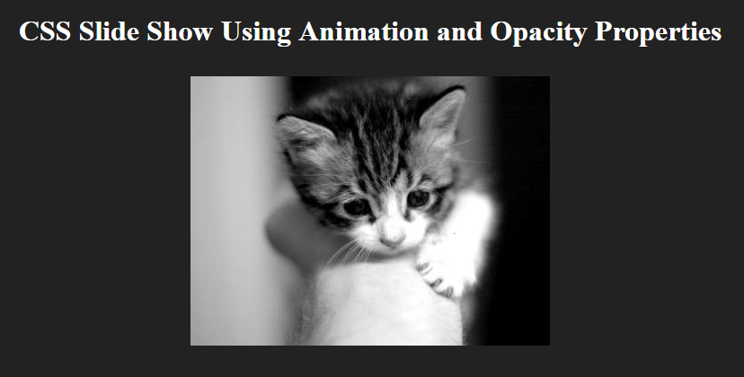

# CSS Slide Show Using Animation And Opacity Properties

In this tutorial, we learn how we can easily build a slide show widget by simply utilizing animation and opacity properties.

Reference: SitePoint AtoZ Series - Opacity Chapter

[View demo site here.](https://webdevtuts.github.io/css_slideshow/)

